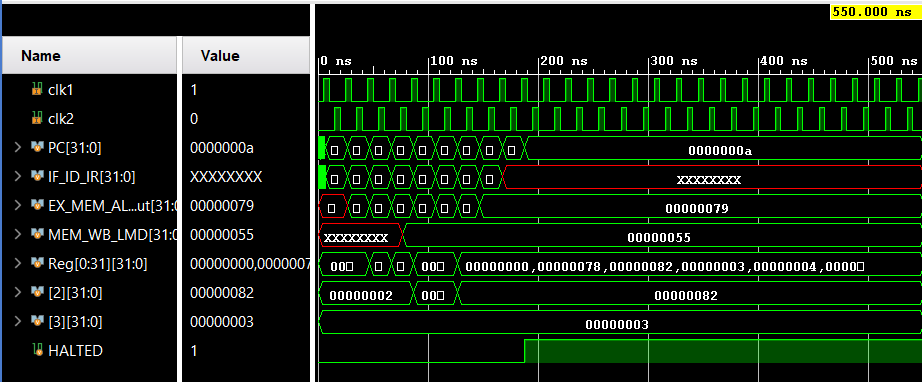

# MIPS32 Five-Stage Pipeline Processor
**Implemented in Verilog HDL | Simulated in Xilinx Vivado**

## Project Overview
This project implements a high-performance 32-bit MIPS processor with a standard 5-stage pipeline architecture (IF, ID, EX, MEM, WB).

## Technical Features
* **Two-Phase Clocking**: Utilizes non-overlapping `clk1` and `clk2` for synchronization.
* **Hazard Mitigation**: Integrated handling for data and control hazards.
* **Instruction Set**: Supports `LW`, `SW`, `ADDI`, and branch logic (`BNEQZ`).

## Verification Results
### 1. Factorial Calculation ($7!$)
Successfully verified iterative branch logic by computing the result **5040** (Hex: `13b0`).

### 2. Memory Path Integrity
Verified correct execution of Load Word and Store Word operations. Successfully loaded **85**, performed addition, and stored the result **130** (Hex: `82`).

